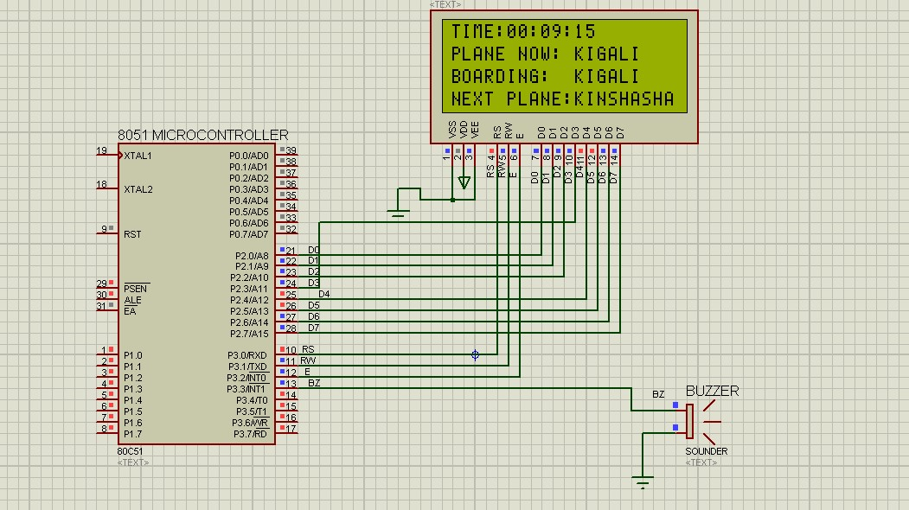
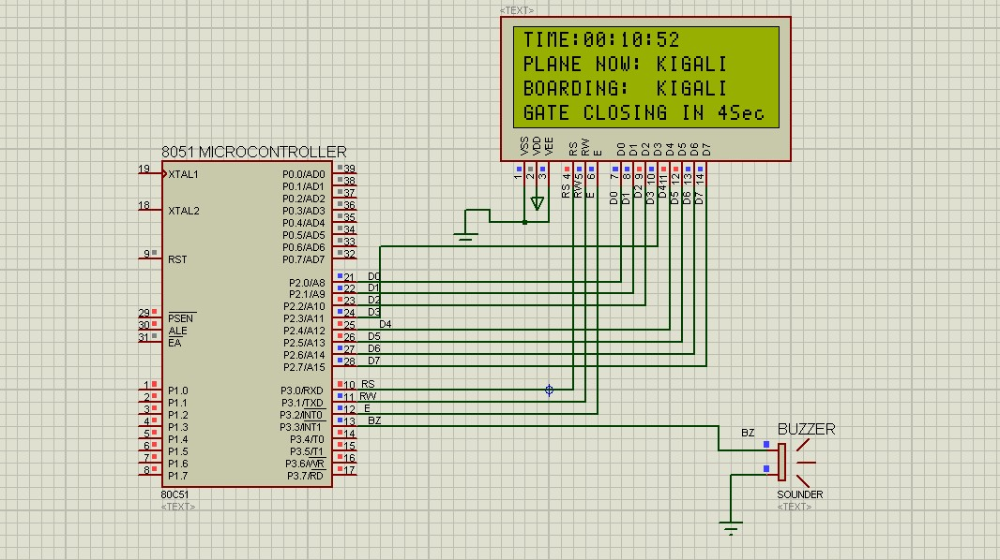
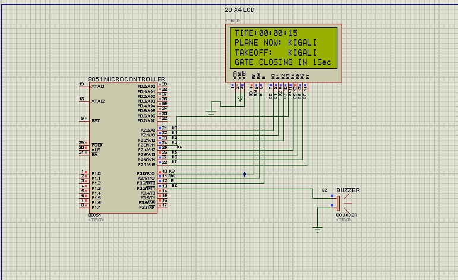

# Airport Display Flight Boarding System


This repository contains an embedded C project for the 8051 microprocessor that simulates a flight boarding system. The system displays messages and signals at specific times before takeoff to ensure a smooth boarding process. 

## Table of Contents
1. [Requirements](#requirements)
2. [Installation](#installation)
3. [Usage](#usage)
4. [Simulation](#simulation)
5. [License](#license)

## Requirements

To run the project, you need the following tools and resources:

- Keil uVision IDE: Used for compiling and flashing the embedded C code onto the 8051 microcontroller.
- Proteus: Used for simulating the hardware setup and testing the system's functionality.
- 8051 Microcontroller: The system is designed for the 8051 microprocessor family.
- LCD Display: Used for displaying boarding messages.
- Buzzer: Used to sound the bell for boarding closing announcements.

## Installation

1. Clone the repository

```bash
git clone https://github.com/drkNsubuga/Airport-display.git
```

2. Open the Keil uVision IDE and create a new project.
3. Add the downloaded files from the repository to the project directory.
4. Build the project to generate the compiled binary file.
5. Set up the Proteus simulation environment with the 8051 microcontroller, LCD display, and buzzer.

## Usage

1. Compile the project in Keil uVision and obtain the binary file.
2. Run the Proteus simulation environment and load the compiled binary hex file onto the 8051 microcontroller.
3. Start the simulation to observe the flight boarding process.

## Simulation

The flight boarding system follows the specifications provided and operates as follows:

1. Ten minutes before takeoff, the message "Flight Kigali boarding" is displayed on the LCD for at least 3 seconds.
2. Five seconds before closing the boarding gate, the message "Gate closing in 5 seconds" is displayed on the LCD and remains until the bell for closing sounds.
3. The boarding gate closes 5 seconds before takeoff, signaled by the sounding of the bell.
4. When the gate closes, no more people are allowed to board.
5. When the plane takes off, the message "Plane taking off" is displayed for 1 second. Simultaneously, the next flight information is displayed on the LCD.

Please refer to the code implementation in the project files for more detailed information about the timing and message display logic.

### Preview Images

Here are some preview images from the Proteus simulation to give you an idea of how the system looks during different stages of the boarding process:

1. Boarding Message Display:


2. Gate Closing Announcement:


3. Plane Taking Off:



## License

This project is licensed under the [MIT License](LICENSE)
